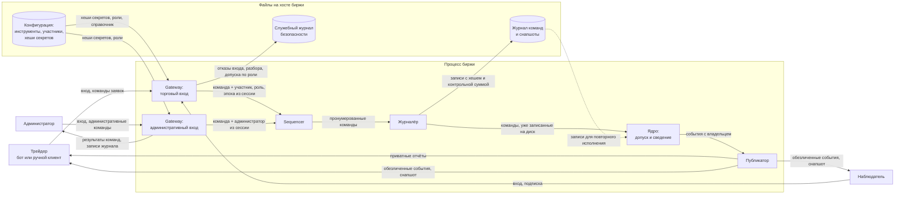

# Модель угроз — Stakan: Order Matching Engine

**Документы проекта:** паспорт — [PROJECT.md](PROJECT.md) · требования безопасности `SR-*` — [SECURITY_REQUIREMENTS.md](SECURITY_REQUIREMENTS.md) · модель угроз `T-*` — [THREAT_MODEL.md](THREAT_MODEL.md) · проектные решения `D-*` — [DESIGN_DECISIONS.md](DESIGN_DECISIONS.md) · вклад участников — [CONTRIBUTIONS.md](CONTRIBUTIONS.md) · использование ИИ — [AI_USAGE.md](AI_USAGE.md)

## Модель продукта

**Точки входа:** торговый вход gateway (вход в сессию, `NEW_ORDER`, `CANCEL`, `REPLACE`, запрос своих заявок, подписка и снапшот); административный вход (`SET_LIMITS`, `OPEN_SESSION`, `CLOSE_SESSION`, `KILL_SWITCH`, разблокировка, чтение журнала); файлы конфигурации, журнала и снапшотов при запуске и восстановлении.

**Кто принимает решения:** gateway — подлинность и допуск типа сообщения по роли, проверки без состояния, лимит частоты; ядро — всё, что зависит от торгового состояния; публикатор — кому уходит приватный отчёт и что попадает в публичный поток.

**Что уже существует:** прототип API с базовым функционалом + прототип реализации sequencer.

**Что пока планируется:** ядро, журналёр, публикатор, административный вход, восстановление.

**Существенные допущения:**

- Сеть между клиентами и биржей не защищена. Участники подключаются через общую сеть, поэтому один участник теоретически может перехватывать или подменять трафик другого.
- Сервер биржи и его операционная система считаются надёжными. Под учётной записью, от которой работает процесс биржи, люди не входят в систему.
- Безопасность клиентских программ участников и то, как участники хранят свои пароли и ключи, — их ответственность, а не наша.
- Биржа работает в одном экземпляре на одном сервере. Резервного сервера нет.
- Администратору мы доверяем, но все его действия должны записываться, чтобы потом можно было проверить, кто, что и когда сделал.

## Границы доверия

|Граница|Что через неё проходит|Почему нужна проверка|
|---|---|---|
| **TB-1.** Клиент → gateway / Админ → gateway|Сообщения клиента: вход в систему, затем заявки, отмены, изменения и ссылки на ID заявок|Клиентская программа принадлежит участнику, и он может отправить что угодно. До входа неизвестно, кто отправитель. После входа отправитель известен, но это не значит, что его команда корректна: формат, значения полей и ID заявок (в том числе чужих) нужно проверять|
| **TB-2.** Обычный участник → административные функции|Административные команды|Трейдер и администратор пользуются одним протоколом и одним gateway, а тип сообщения выбирает сам отправитель. Право выполнять административную команду должно определяться ролью сессии, а не тем, что написано в сообщении|
| **TB-3.** Процесс биржи ↔ файлы на диске|Журнал, снапшоты, конфигурация с хешами паролей|Файл мог оборваться при сбое или быть изменён кем-то с доступом к серверу. То, что биржа сама записала эти данные, не гарантирует, что при чтении они остались прежними|
| **TB-4.** Ядро → получатели событий|Отчёты по заявкам и публичный поток стакана|Внутри ядра известно, чья каждая заявка; снаружи это должен знать только её владелец. Ошибка в выборе получателя или лишнее поле в сообщении раскрывают чужие данные|

## Значимые объекты и свойства

См. [паспорт, §5](PROJECT.md#sec-5).

## Угрозы

| ID | Краткое описание | Сценарий угрозы | Что нарушается | Граница / точка входа | Связанные SR | Приоритет и обоснование |
| --- | --- | --- | --- | --- | --- | --- |
| T-01 | Отмена или изменение чужой заявки | Трейдер A видит биржевой ID заявки трейдера B в публичном потоке и отправляет CANCEL или REPLACE с этим ID. Если ядро находит заявку по ID без проверки владельца, котировка B снимается или сдвигается, и B теряет место в очереди | Авторизация; целостность чужих заявок | [TB-1](#tb-1); CANCEL/REPLACE торговой сессии | [SR-01](SECURITY_REQUIREMENTS.md#sr-01) | Высокий — идентификаторы публичны по замыслу, хватает одного сообщения; задеты основные сценарии [2](PROJECT.md#scenario-2) и [3](PROJECT.md#scenario-3). В приоритетном наборе |
| T-02 | Некорректное сообщение останавливает или портит ядро | Участник отправляет сообщение, у которого длина в заголовке больше фактической, или заявку с такими ценой и объёмом, что их произведение переполняет 64-битное число. Без проверки однопоточное ядро падает или записывает неверные значения, и торги останавливаются для всех. Если команда уже попала в журнал, ядро будет падать на ней при каждом восстановлении | Доступность торгов для всех; целостность стакана | [TB-1](#tb-1) (любое сообщение сессии); [TB-3](#tb-3) (повторное исполнение журнала) | [SR-05](SECURITY_REQUIREMENTS.md#sr-05) | Высокий — ядро однопоточное и единственное, один сбой останавливает биржу, вариант с журналом делает остановку постоянной. В приоритетном наборе |
| T-03 | Один клиент исчерпывает ресурсы биржи | Участник открывает сотни соединений, шлёт команды с максимальной частотой или подписывается на поток и не читает его. Очереди gateway и буферы публикатора растут, задержки для остальных участников увеличиваются вплоть до исчерпания памяти | Доступность; равные условия по задержке | [TB-1](#tb-1) (соединения, вход, поток команд); [TB-4](#tb-4) (буфер подписчика) | [SR-09](SECURITY_REQUIREMENTS.md#sr-09) | Средний — реализуется легко, но последствия временные и снимаются отключением клиента; участники известны заранее (пересмотреть при открытой сети с незнакомыми участниками) |
| T-04 | Приватный отчёт уходит другому участнику | Участник A отключается, пока в очереди публикатора лежат отчёты по его заявкам. ОС выдаёт освободившийся номер сокета A новому подключению участника B. Если публикатор адресует отчёты по номеру соединения, а не по участнику, отчёты о сделках и заявках A уходят B | Конфиденциальность сделок и заявок участника | [TB-4](#tb-4); маршрутизация приватных отчётов | [SR-03](SECURITY_REQUIREMENTS.md#sr-03) | Средний — злоумышленник не нужен, зависит от того, как публикатор выбирает адресата |
| T-05 | Установление владельца по публичному потоку | Наблюдатель связывает заявки с владельцем по публичному потоку: биржевой ID содержит номер участника, или заявки одного участника получают соседние ID, или массовая отмена при обрыве соединения приходит пачкой. Так раскрываются позиции и стратегия маркет-мейкера | Конфиденциальность принадлежности заявок; раскрытие позиций и стратегий | [TB-4](#tb-4); публичные события и снапшот | [SR-04](SECURITY_REQUIREMENTS.md#sr-04) | Средний — источник угрозы в составе полей события, а не в действиях наблюдателя; связывание пачкой отмен допущено как исключение в [SR-04](SECURITY_REQUIREMENTS.md#sr-04) |
| T-06 | Подтверждённая сделка исчезает после сбоя | Ядро исполнило сделку, и отчёты ушли участникам, но запись команды ещё не дошла до диска, а процесс упал. После восстановления сделки нет, хотя участники считают её состоявшейся; спор разрешить нечем | Целостность торгового состояния; подотчётность | [TB-3](#tb-3); запись журнала относительно отправки исходящих сообщений | [SR-07](SECURITY_REQUIREMENTS.md#sr-07) | Высокий — окно существует на каждом батче без действий участников; подрывает recovery и разбор споров ([сценарий 7](PROJECT.md#scenario-7)). В приоритетном наборе |
| T-07 | Изменение журнала задним числом | Человек с правами учётной записи биржи удаляет или переставляет записи журнала, чтобы изменить исход спора или скрыть административное действие. Без защиты целостности подмену невозможно обнаружить | Целостность журнала; подотчётность административных действий | [TB-3](#tb-3); файлы журнала | [SR-08](SECURITY_REQUIREMENTS.md#sr-08) | Низкий — нужен доступ к хосту с правами процесса биржи (сейчас только у команды-оператора); торговое состояние не затронуто, страдает достоверность разбора (пересмотреть, если оператор и участники — разные стороны) |

## Приоритетный набор

В набор вошли все угрозы с высоким приоритетом. Их объединяет то, что сценарий доступен любому участнику (или не требует участника вовсе), а последствие — изменение чужих заявок, остановка торгов или недостоверное состояние биржи.

| Угроза | Требование | Решение |
| --- | --- | --- |
| [T-01](#t-01) | [SR-01](SECURITY_REQUIREMENTS.md#sr-01) | [D-01](DESIGN_DECISIONS.md#d-01) |
| [T-02](#t-02) | [SR-05](SECURITY_REQUIREMENTS.md#sr-05) | [D-02](DESIGN_DECISIONS.md#d-02) |
| [T-06](#t-06) | [SR-07](SECURITY_REQUIREMENTS.md#sr-07) | [D-03](DESIGN_DECISIONS.md#d-03) |
